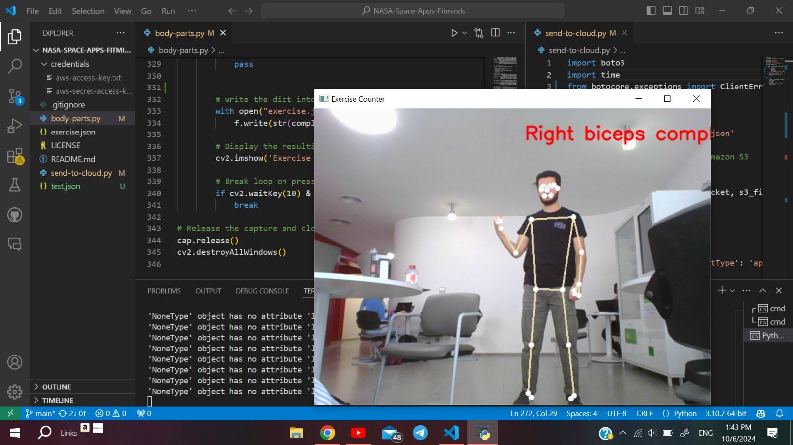

# Micro Gravity Fitness Machine for Astronauts

Astronauts in space face challenges such as muscle loss, and mental stress due to long periods in zero gravity. This project aims to solve these issues by creating a **space fitness machine** that combines physical exercises and mental well-being. The system uses advanced technology to simulate Earth-like workouts and environments, helping astronauts maintain both their physical and mental health.

## Project Overview

The smart fitness machine combines hardware and software to create an interactive workout experience for astronauts. The main part of the system is a **motor-powered fitness machine** that replaces traditional weights with stepper motors. It tracks the astronaut's movements and sends data to a mobile app. For added immersion, astronauts can wear **VR headsets** to experience virtual Earth environments during their workouts.

## Key Components

### 1. Gym Cable Machine Design
- The device resembles a traditional gym cable machine but is foldable for **easy storage**.
- Instead of weights, **stepper motors** provide adjustable resistance.
- The machine's height can be adjusted for different exercises.

### 2. Motorized Resistance
- We selected an **efficient but high tourqe stepper mototr** due to its balance of perforamnce and cost.
- The motors provide enough resistance to simulate weight training in zero gravity.
- The design is **space-saving** and **cost-effective** compared to existing equipment.

### 3. Camera and Computer Vision
- A camera tracks the astronaut’s movements and counts repetitions.
- All workout data is sent to a mobile app through an API, allowing astronauts to monitor their progress.

### 4. Virtual Reality (VR)
- Astronauts can wear a **VR headset** to work out in Earth-like environments or participate in interactive games.
- This feature adds fun to workouts and helps reduce mental stress by simulating familiar settings.

## Why This Solution?
This solution is designed to be **compact**, **easy to use**, and **affordable**. Current space gym equipment, like the Advanced Resistive Exercise Device (ARED), is large and expensive. Our machine, with **stepper motors** and **VR integration**, is much smaller and more cost-effective, while still offering effective physical exercise and mental relief.

## Cost Comparison

The Advanced Resistive Exercise Device (ARED) used on the ISS costs around **$250,000**. In comparison, our system, which includes mid-range stepper motors and VR technology, is far more affordable:

| **Motor Type**        | **Brand**                         | **Torque (Nm)** | **Price**        |
|-----------------------|-----------------------------------|-----------------|-----------------|
| High-end Stepper Motor | Applied Motion Products HT23-601  | 3.0 Nm          | $200 - $250      |
| Mid-range Stepper Motor | NEMA 23 by StepperOnline          | 1.9 Nm          | $80 - $120       |
| Cost-efficient Motor   | Usongshine NEMA 17 Stepper Motor  | 0.6 Nm          | $30 - $50        |

We chose the **mid-range motor** as it provides the best balance between performance and cost for our system.

## Conclusion

This project combines physical exercise with mental relaxation for astronauts in space. Using **motor-powered gym equipment** and **VR technology**, we’ve developed an efficient, compact, and cost-effective solution that will help astronauts stay healthy during long missions.

